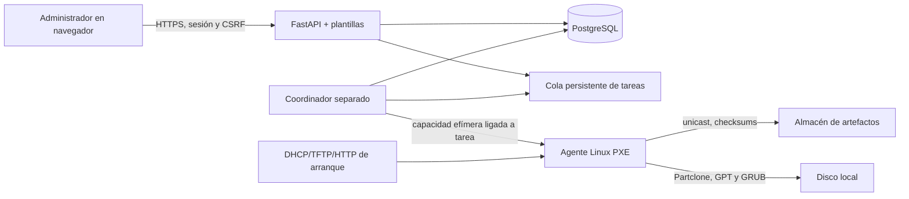

# ADR 0001: contrato operativo del MVP Linux

**Estado:** aceptado el 16 de septiembre de 2026.

**Issue:** [#2](https://github.com/cavazquez/pyfog/issues/2).

PyFog empieza con el registro e inventario de equipos y avanza hacia una operación de imagen por
red pequeña y verificable. Este documento fija el contrato que deben cumplir el coordinador, el
agente PXE y el formato de imagen antes de habilitar escrituras sobre discos. El alcance inicial no
habilitaba la captura, restauración ni clonación; la implementación posterior de los issues #23–30
habilita la captura de solo lectura sobre el origen y la publicación verificada de sus artefactos.

## Plataforma admitida

La primera imagen que PyFog podrá procesar es una instalación de referencia de **Ubuntu Server
24.04 LTS** con estas condiciones simultáneas:

| Área | Contrato del MVP |
| --- | --- |
| Arquitectura y arranque | x86_64, firmware UEFI, GRUB y systemd. Secure Boot queda desactivado. |
| Tabla y particiones | GPT; una ESP FAT32; raíz ext4; swap opcional. Puede haber `/boot` ext4 dentro del mismo disco. |
| Discos | Un solo disco de sistema visible para la tarea. El destino tiene capacidad en sectores igual o mayor que el origen y el mismo tamaño de sector lógico. |
| Operación de datos | No se redimensionan particiones ni sistemas de archivos. El manifiesto describe el layout y cada artefacto antes de escribir. |
| Transferencia | LAN cableada, unicast y una única operación de escritura por equipo. |

Quedan fuera de este MVP: BIOS, Secure Boot, MBR, más de un disco, LVM, RAID, mdadm, ZFS, Btrfs,
XFS, LUKS/dm-crypt, Windows, macOS, arquitecturas distintas de x86_64 y redimensionamiento.
El inventario puede informar esos equipos; solamente no los hace compatibles con imágenes.

## Significado de las operaciones

| Operación | Lee | Escribe | Resultado |
| --- | --- | --- | --- |
| Captura | El disco de un equipo origen aprobado. | Nunca el disco origen. | Una imagen inmutable y versionada: tabla GPT, artefactos de partición, manifiesto y checksums. |
| Restauración | Una imagen validada. | El disco del mismo equipo registrado, previa aprobación explícita. | Recupera el layout y los datos de la imagen. Conserva la identidad de esa instalación. |
| Clonación | Una imagen validada. | El disco de un equipo destino distinto, previa aprobación explícita. | Despliega la imagen y aplica una identidad nueva antes del primer arranque. |

La identidad nueva de una clonación consiste, como mínimo, en vaciar `/etc/machine-id` para que
systemd lo regenere y eliminar las claves de host SSH para que el servicio las vuelva a crear. El
hostname se asigna por la tarea; si no hay uno asignado, el agente detiene la clonación antes del
primer arranque. Restaurar no ejecuta esa preparación.

## Arquitectura y límites de confianza

La aplicación web nunca abre un dispositivo de bloques ni ejecuta Partclone. FastAPI valida la
intención del administrador, persiste el estado y coordina un único agente efímero arrancado por
PXE. DHCP puede seguir siendo un servicio de la red existente: PyFog publica los archivos de
arranque y documenta la configuración o relay, sin tomar control global del DHCP.

SQLite es suficiente para el registro e inventario local actual. Antes de ejecutar tareas de
imagen, la instalación de producción usa PostgreSQL 17 y un almacén de artefactos local o compatible
con S3. Esa separación permite recuperar el coordinador sin perder las tareas ni mezclar los datos
de control con los bloques de imagen.

## Contratos de datos y versiones

La API mantiene el prefijo `/api/v1`; el inventario es JSON `schema_version: 1` y los informes son
inmutables e idempotentes por `report_id`. Las rutas de agente y tareas usan JSON versionado,
timestamps UTC ISO-8601 y errores documentados. Un cambio incompatible abre una versión nueva; no se
reinterpretan manifiestos existentes.

Una imagen contiene el manifiesto `pyfog-disk-image` v1, el UUID de imagen, la geometría de disco,
las particiones admitidas, el algoritmo de checksum y el SHA-256 de cada artefacto. El contrato
completo está en [`docs/image-manifest.md`](../image-manifest.md). La captura escribe primero a un
espacio temporal, verifica todo el manifiesto y recién entonces publica la versión.
Una restauración o clonación rechaza un manifiesto incompleto, una suma inválida, una geometría
incompatible o una imagen marcada como no publicable.

El catálogo web registra esa identidad antes de la captura. El nombre exacto es único, la ficha
empieza en `draft` y su UUID no cambia al editar la descripción. El coordinador sólo podrá ofrecer
una imagen `ready` cuya publicación y verificación de integridad hayan terminado; una captura nueva
debe crear o reservar otra versión en lugar de reemplazar una versión lista.

| Componente | Elección inicial |
| --- | --- |
| Servicio web | Python 3.12, FastAPI 0.141.1, Pydantic 2.13.5, SQLAlchemy 2.0.54 y Alembic 1.20.0. Las versiones exactas viven en `pyproject.toml` y `uv.lock`. |
| Base de tareas en producción | PostgreSQL 17. |
| Agente de imágenes | Linux de Ubuntu 24.04 LTS, Partclone 0.3.45, `sgdisk` y herramientas GRUB de esa distribución. |
| Arranque PXE | iPXE y un kernel/initramfs reproducibles. Los issues [#18](https://github.com/cavazquez/pyfog/issues/18), [#19](https://github.com/cavazquez/pyfog/issues/19) y [#20](https://github.com/cavazquez/pyfog/issues/20) publican un agente de inventario seguro, retorno al disco local y aprobación de equipos descubiertos; el modo `imaging` sólo se construye cuando sus herramientas están presentes y sus hashes fueron revisados. |

El manifiesto del agente fija las versiones y checksums efectivos de kernel, initramfs, iPXE y
paquetes. Ningún agente toma herramientas de un repositorio mutable durante una operación.

## Seguridad y operación

La dirección MAC sirve para reconocer un equipo, nunca para autenticarlo. El agente se registra con
un desafío de un solo uso visible en la consola y recibe una capacidad efímera ligada a la sesión,
UUID del equipo, vencimiento y número de uso. Para una captura, el token vigente del equipo sólo
permite reclamar una tarea de ese equipo; el coordinador lo cambia por una capacidad ligada al
intento, con vencimiento y secuencia propios. La interfaz exige una confirmación que nombra equipo,
operación y disco origen antes de encolar la tarea.

El canal web y el canal de agente usan HTTPS con certificados de la CA de la instalación; el agente
no sigue redirecciones ni usa proxies heredados. Los tokens, claves y rutas de almacenamiento no se
incluyen en HTML, logs de progreso ni manifiestos. La primera entrega permite un único administrador
local; la autorización por roles queda para una etapa posterior. El detalle de despliegue TLS está
en la [guía HTTPS](../https.md), implementada en el issue [#7](https://github.com/cavazquez/pyfog/issues/7).

Cada tarea persiste una máquina de estados: `draft`, `approved`, `assigned`, `running`, `verifying`,
`succeeded`, `failed`, `cancelled` o `intervention_required`. Sólo el coordinador puede avanzar
estados; los eventos del agente llevan un número de secuencia para que un reintento no duplique una
escritura. Una lease vencida deja la tarea en `intervention_required`, libera el slot de transferencia
y conserva la reserva del equipo: nunca reanuda una operación sin una confirmación nueva.

## Validación pendiente para completar el MVP

El laboratorio reproducible de los issues [#17](https://github.com/cavazquez/pyfog/issues/17) y
[#45](https://github.com/cavazquez/pyfog/issues/45) debe automatizar al menos estos casos con QEMU,
OVMF y la imagen de referencia:

1. Captura una fuente admitida y comprueba las sumas de todos sus artefactos.
2. Restaura en un disco del mismo tamaño y arranca UEFI hasta systemd.
3. Clona en un disco mayor, arranca y confirma un `machine-id`, claves SSH y hostname nuevos.
4. Rechaza antes de escribir un destino menor, un sector lógico distinto, un segundo disco o un
   layout no admitido.
5. Rechaza manifiestos alterados, artefactos incompletos, capacidades vencidas y una segunda tarea
   concurrente para el mismo equipo.
6. Simula pérdida de red, cancelación y reinicio del coordinador; deja evidencia de diagnóstico y no
   publica una imagen parcial.

Partclone se elige porque copia bloques utilizados de ext4 y mantiene el alcance pequeño. `dd` no
es la base del MVP porque copia espacio libre y oculta la semántica del sistema de archivos. No se
busca compatibilidad binaria con FOG o Clonezilla; el formato propio versionado prioriza la
verificación y una matriz de soporte explícita.
