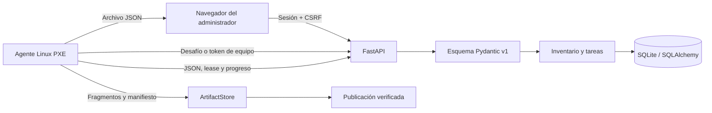

# Arquitectura de PyFog

Estado: registro, inventario, descubrimiento PXE aprobado, captura Linux verificada, restauración,
clonación y operación de un único coordinador están implementados. La coordinación distribuida
sigue fuera del MVP. El contrato que guía las próximas etapas está en la
[ADR 0001: MVP Linux](adr/0001-mvp-linux.md).

## Primera entrega

Se utiliza FastAPI, plantillas Jinja2 y CSS local. No se incorpora Django ni una aplicación frontend
separada. La UI opera sin servicios externos ni CDNs. SQLAlchemy separa la persistencia de las rutas;
Alembic aplica migraciones explícitas. SQLite permite comenzar con un solo proceso y sin instalar
una base externa. La ADR fija PostgreSQL 17 como persistencia de tareas antes de habilitar el
coordinador de imágenes.

Cada equipo tiene un UUID estable y una MAC principal normalizada y única. La MAC es inmutable en
la edición inicial; nombre y notas se pueden cambiar. Las interfaces adicionales se describen en
los informes sin constituir nuevas credenciales. Los equipos descubiertos por PXE aparecen como
solicitudes de corta duración. La MAC sólo sirve para encontrar candidatos; el administrador
verifica un desafío que el agente muestra localmente y recién entonces asocia la sesión a un equipo
nuevo o existente. La capacidad temporal sólo permite publicar el primer inventario y se consume al
aceptarlo.

Los informes guardan `report_id`, datos validados, fecha de recolección y fecha de recepción UTC.
La combinación equipo/report_id es única. Reenviar el mismo contenido no crea otro informe;
reutilizar el identificador con contenido diferente es un conflicto. Los informes son inmutables.
El inventario actual se elige por fecha de recolección; un informe atrasado no reemplaza datos nuevos.

## Acceso

El administrador se crea por CLI, sin contraseña predeterminada. Argon2 mediante pwdlib almacena
contraseñas. Las cookies están firmadas, son HttpOnly y SameSite=Lax; contienen un token de sesión
aleatorio cuyo hash y vencimiento se validan en base de datos. Logout y cambio de contraseña revocan
sesiones. Los formularios usan tokens CSRF y el login limita intentos por dirección remota.

Las credenciales de inventario son independientes: aleatorias, limitadas a un equipo, revocables y
con 24 horas de vigencia. Se pueden rotar con una gracia acotada sin invalidar de golpe a un agente
desconectado; la revocación invalida también capacidades de tareas ya reclamadas. La API no admite una cookie web como sustituto del Bearer token. Los
informes se limitan a 1 MiB antes de parsear el cuerpo; el servidor rechaza esquemas desconocidos,
hardware inválido y MACs que no coinciden con el registro. Jinja2 escapa HTML y la política CSP
limita recursos al servidor.

El desarrollo usa HTTP en loopback. El cliente exige HTTPS fuera de loopback y valida certificados;
el modo `production` exige clave de sesión, hosts y proxy explícitos, cookies seguras y `DEBUG`
apagado. [La guía HTTPS](./https.md) describe el proxy Caddy, la CA local y el material público que
podrá recibir el agente PXE.

## Catálogo y motor de imágenes

El catálogo web ya conserva la identidad, descripción, estado y metadatos de publicación de cada
imagen. Una ficha se crea como `draft`, tiene un UUID estable y no permite que una nueva captura
reemplace silenciosamente una versión lista: los nombres exactos son únicos y la edición web sólo
modifica sus datos descriptivos. La selección para restaurar queda habilitada cuando el estado es
`ready`, existe un manifiesto y se registró su verificación de integridad.

La web crea tareas persistentes de captura a partir de un inventario reciente. Una tarea reserva el
equipo y el único slot de transferencia, y un agente Linux arrancado por PXE la reclama con las
capacidades requeridas. Cada intento tiene un token de tarea, lease, heartbeat y eventos con
secuencia, duración, throughput y código de fallo; una lease vencida pasa a
`intervention_required` y nunca se reasigna automáticamente. El formato portable está en
[Observabilidad operativa](observability.md).

El agente en modo `imaging` vuelve a leer el inventario, identifica el disco por WWN, serie o ruta
junto con capacidad y modelo, comprueba el perfil Ubuntu UEFI/GPT o BIOS/MBR y que ningún sistema de
archivos o swap esté montado. Partclone lee ESP cuando el perfil es UEFI, o `/boot` y raíz ext4 en
modo de solo lectura cuando es BIOS; en este último caso también conserva y valida el boot sector,
incluido el espacio de embedding requerido por GRUB BIOS, y
sube artefactos comprimidos por fragmentos con SHA-256. El servidor valida el manifiesto v1/v2,
sus capacidades, las geometrías, las sumas y los archivos declarados antes de mover el staging a
`published` en una operación atómica; sólo entonces cambia la imagen a `ready`.

El agente que se empaqueta en [`agent/`](../agent/README.md) conserva inventario como modo
predeterminado y agrega las herramientas de imagen sólo al construir `imaging`. El perfil iPXE de
[`pxe/`](../pxe/README.md) publica el agente por HTTPS, ofrece inventario o retorno al disco local
con timeout y no toma control del DHCP. Por diseño, un perfil de captura necesita un mecanismo
controlado para colocar el token del equipo en un archivo `tmpfs`; nunca se incluye en iPXE, DHCP o
la línea de comandos. Restauración conserva la identidad del origen y clonación regenera la
identidad Linux antes del primer arranque; ambas reutilizan el manifiesto y las mismas fronteras de
seguridad. La distribución masiva queda analizada y acotada en el
[ADR 0002](adr/0002-distribucion-masiva.md): el primer experimento usará torrent privado con
`aria2c` y HTTP seed, sin cambiar HTTPS como plano de control ni introducir multicast propio en el
MVP.
