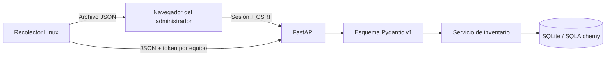

# Decisión inicial: registro e inventario

Estado: base implementada; el contrato del motor de imágenes se completa en
[el issue de arquitectura](https://github.com/cavazquez/pyfog/issues/2).

## Primera entrega

Se utiliza FastAPI, plantillas Jinja2 y CSS local. No se incorpora Django ni una aplicación frontend
separada. La UI opera sin servicios externos ni CDNs. SQLAlchemy separa la persistencia de las rutas;
Alembic aplica migraciones explícitas. SQLite permite comenzar con un solo proceso y sin instalar
una base externa; la migración a PostgreSQL se evaluará antes del coordinador de imágenes.

Cada equipo tiene un UUID estable y una MAC principal normalizada y única. La MAC es inmutable en
la edición inicial; nombre y notas se pueden cambiar. Las interfaces adicionales se describen en
los informes sin constituir nuevas credenciales. La aprobación de dispositivos descubiertos por
PXE es una característica posterior.

Los informes guardan `report_id`, datos validados, fecha de recolección y fecha de recepción UTC.
La combinación equipo/report_id es única. Reenviar el mismo contenido no crea otro informe;
reutilizar el identificador con contenido diferente es un conflicto. Los informes son inmutables.
El inventario actual se elige por fecha de recolección; un informe atrasado no reemplaza datos nuevos.

## Acceso

El administrador se crea por CLI, sin contraseña predeterminada. Argon2 mediante pwdlib almacena
contraseñas. Las cookies están firmadas, son HttpOnly y SameSite=Lax; contienen un token de sesión
aleatorio cuyo hash y vencimiento se validan en base de datos. Logout y cambio de contraseña revocan
sesiones. Los formularios usan tokens CSRF y el login limita intentos por dirección remota.

Las credenciales de inventario son independientes: aleatorias, limitadas a un equipo, revocables y
con 24 horas de vigencia. La API no admite una cookie web como sustituto del Bearer token. Los
informes se limitan a 1 MiB antes de parsear el cuerpo; el servidor rechaza esquemas desconocidos,
hardware inválido y MACs que no coinciden con el registro. Jinja2 escapa HTML y la política CSP
limita recursos al servidor.

El desarrollo usa HTTP en loopback. El cliente exige HTTPS fuera de loopback y valida certificados;
el modo `production` exige clave de sesión y cookies seguras. El empaquetado TLS, la confianza del
agente PXE y los ajustes de proxy/red son trabajo posterior explícito en el roadmap.

## Motor de imágenes previsto

La web programará tareas persistentes; el agente Linux arrancado por PXE ejecutará las operaciones
fuera del proceso web. Se propone [Partclone](https://github.com/Thomas-Tsai/partclone) para capturar
y restaurar los bloques usados de las particiones admitidas, junto con herramientas GPT y GRUB.
El formato propio incluirá manifiesto versionado, layout, artefactos y checksums.

Capturar lee el origen; restaurar recupera su disco e identidad; clonar despliega la imagen en otro
equipo y prepara una identidad nueva. La preparación de la identidad seguirá el perfil soportado de
Linux y las [indicaciones de systemd](https://systemd.io/BUILDING_IMAGES/). No se implementan estas
operaciones todavía ni se realizan escrituras a dispositivos de bloques en esta entrega.

La matriz propuesta es Linux x86_64 con systemd/GRUB, UEFI sin Secure Boot, GPT, ext4, ESP FAT32 y
swap opcional. Un disco por tarea, sector lógico compatible y capacidad destino igual o mayor;
sin redimensionado automático, LVM, RAID ni cifrado. El laboratorio fijará la distribución de
referencia y validará arranque real en VMs antes de habilitar una restauración.
